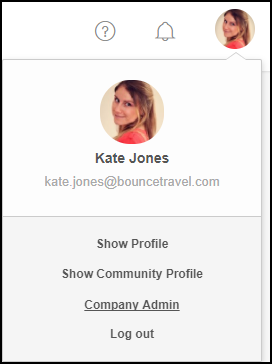
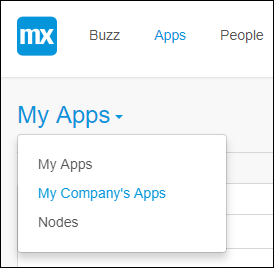
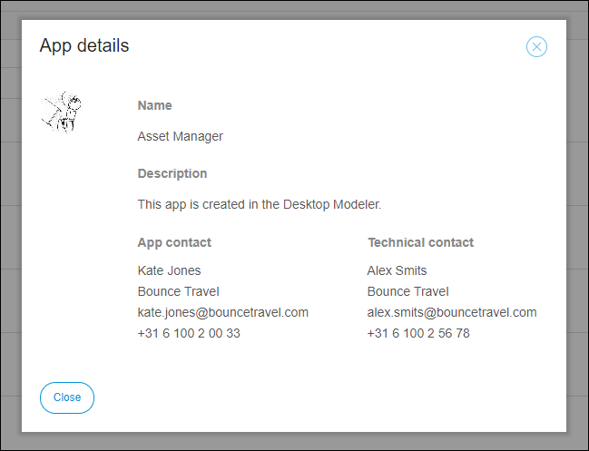

## 1 Introduction

In order to use Mendix, you must sign up to create an account. With this signup you create a **MxID** and this ID will be linked to a company. If the company already exists, you will join the company. If it is a new company, a new company will be created and you will automatically join it. 

Within a company and the company's apps there are roles defined that are described below:

## 2 Company Roles

Everyone with the same emaildomain will be automatically placed in the same company. For example all users that will signup with an email address with the @mendix.com emaildomain, will automatically join the company named 'Mendix'.

Within the company there are two roles described below:

### 2.1 Company Admin

The company admin is a super role that is allowed to manage all settings of the company including the settings of apps, nodes and users. The permissions of a Company Admin are:

* Can manage company (profile, admins, groups and settings)
* Can manage users, invitations and security group memberships
* Can manage apps and app roles
* Can manage nodes

  

For more details, see [Company Admin](/developerportal/companyadmin).

### 2.2 Regular Users

The regular users can join the company and start building apps. Regular users can also view other apps made within the company. 

  

## 3 App Roles

If you click **My Company's Apps** in the [Developer Portal](http://home.mendix.com), you can view the apps. If you select a specific app, you will see two responsible roles for the app. You can contact them with questions related to the app. When then the app is not a licensed app, it will not have a Technical Contact. 
The roles are described below:

  

### 2.2 App Contact

The App Contact is the to-go person for questions related to the app. If you build an app, you will automatically become the **App Contact**.

### 2.3 Technical Contact

The Technical Contact manages the settings of the the technical deployment aspect of the app. The Technical COntact is also the first contact point of Mendix Support for the app.  The Technical Contact can be responsible for different deployment platforms: Mendix Cloud node, On-premises, other plaforms such as MxBlue, Azure etc.

Only the **Technical Contact** is allowed to:

* manage the users with node permissions
* make adjustments to the environments (resize/new environments etc.)
* manage licenses (renewals/activation/upgrades)
* configure the alert settings

## 4. Team Member Roles

Within an App Team there are six predefined roles that can be provisioned to Team Members. You can also create new team roles within your company. The predefined team member roles are described below:

* Application Operator - is mainly responsible for the deploying new versions of the application. The node permissions must be provisioned by the Technical Contact.
* Business Engineer - is able to use almost all features in the Developer Portal, but is not able to change the settings. The node permissions must be provisioned by the Technical Contact.
* End-user - has a limited view of the Developer Portal. The end-user can only add feedback and documents.
* Product Owner - can edit the most of the features of the app, but has no access to the model or the node.
* SCRUM Master - if you create a new app, you will automatically become a SCRUM Master. A SCRUM Master is responsible for the development process. He/she can manage all settings within the app. The node permissions must be provisioned by the Technical Contact.

## 5 Related Content

*   [Company Admin](/developerportal/companyadmin)
*   [Settings](/developerportal/settings)
